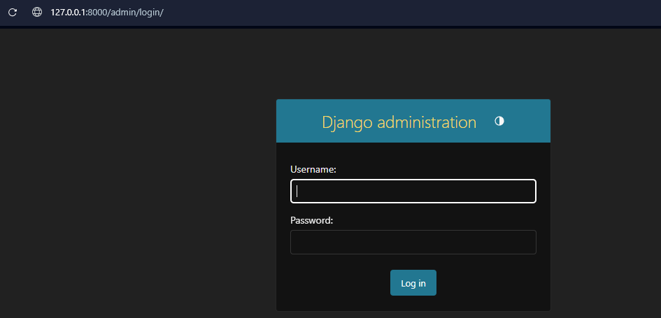
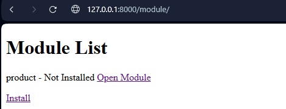
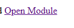
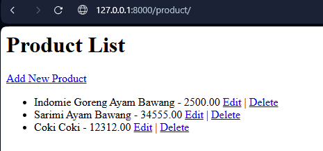
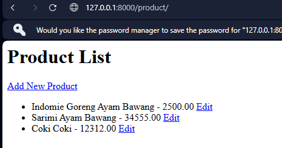
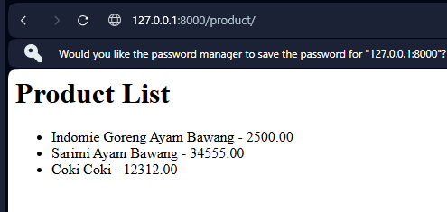
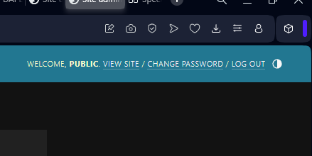

### Cara Menjalankan Project

```
python manage.py runserver
```

### Login

Untuk Login gunakan 3 Akses Berikut :



Manager (CRUD) -> u: @manager p: iniPassword

User (CRU) -> u: @user p: iniPassword

public (R) -> u: @public p: iniPassword

### Module List

Untuk mengakses module silahkan melalui url `/module`



Module hanya dapat diakses jika sudah klik `install` dan tidak dapat diakses jika module `di-uninstall`

### Akses Module

Untuk Akses Module cukup dengan mengakses `Open Module`



Preview Akses Manager



Preview Akses User



Preview Akses Public




### Logout

Untuk Melakukan Logout Sementara Melalui `/admin` dan klik tombol `logout`




