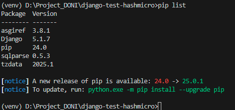

### Cara Menjalankan Project

Aktifkan virtual environment(venv) 

- Pada OS WIndows masuk ke Command Prompt
```
venv\Scripts\Activate
```

Pastikan venv aktif seperti pada gambar dibawah ini :


- Cek Dependency pada venv :
```
pip freeze
```
Maka Akan tampil seperti berikut :


- Install Dependency sendiri melalui requirement.txt :
```
pip install -r requirements.txt
```
- Cek Dependency dengan :

```
pip list
```



- Menonaktifkan venv :
```
deaktivate
```
Berikut tampilan venv tidak aktif :


- Menjalankan Project
```
python manage.py runserver
```

### Login

Untuk Login gunakan 3 Akses Berikut :


Manager (CRUD) -> u: @manager p: iniPassword

User (CRU) -> u: @user p: iniPassword

public (R) -> u: @public p: iniPassword

### Module List

Untuk mengakses module silahkan melalui url `/module`


Module hanya dapat diakses jika sudah klik `install` dan tidak dapat diakses jika module `di-uninstall`

### Akses Module

Untuk Akses Module cukup dengan mengakses `Open Module`


Preview Akses Manager


Preview Akses User


Preview Akses Public


### Logout

Untuk Melakukan Logout Sementara Melalui `/admin` dan klik tombol `logout`


